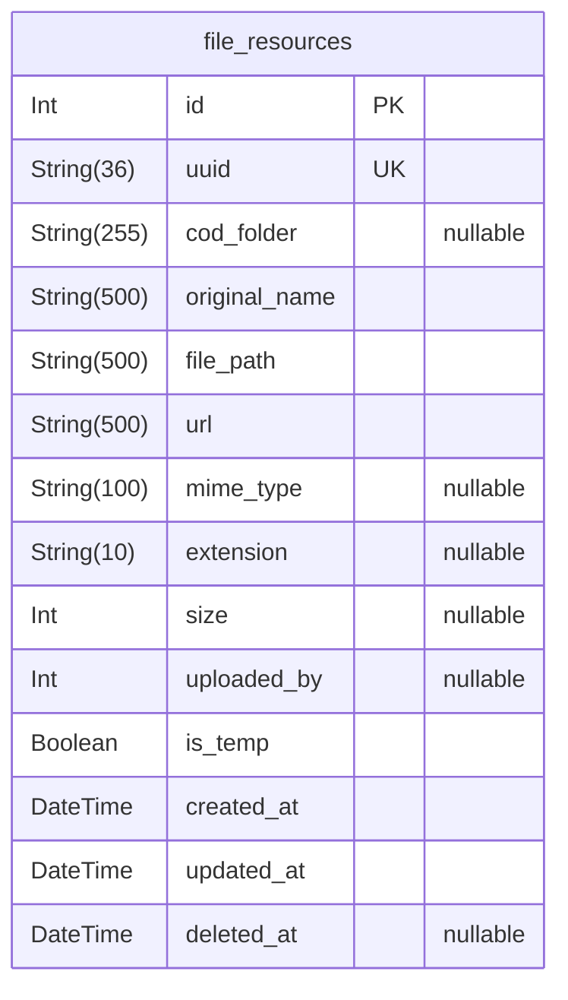

# Cross - Entity Relationship Diagram

> Generated by [`prisma-markdown`](https://github.com/samchon/prisma-markdown)

- [default](#default)

## default

### `file_resources`

Properties as follows:

- `id`:
- `uuid`:
- `cod_folder`:
- `original_name`:
- `file_path`:
- `url`:
- `mime_type`:
- `extension`:
- `size`:
- `uploaded_by`:
- `is_temp`:
- `created_at`:
- `updated_at`:
- `deleted_at`:
